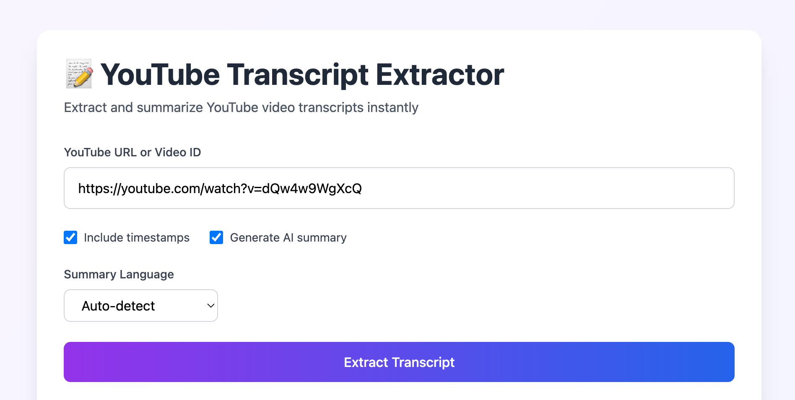

# YouTube Transcript Extractor with Gemini Summarization

A Python script that extracts transcripts from YouTube videos using `yt-dlp` and converts them to clean, readable Markdown format. Includes optional AI-powered summarization using Google's Gemini API.

## Features
- 🔗 **Robust YouTube URL handling** various URL formats and video IDs
- 🎥 **Reliable transcript extraction** using yt-dlp
- 📝 **Clean Markdown output** with optional timestamps
- 🤖 **AI summarization** powered by Gemini API
- 🌐 **Multi-language support** (optimized for English and Japanese)


## Installation
1. **Install Python dependencies:**
   ```bash
   pip install yt-dlp
   
   # Optional: FastAPI
   pip install fastapi uvicorn
   ```

2. **Download the script:**
   ```bash
   git clone https://github.com/kkensuke/yt_dlp_transcript
   cd yt_dlp_transcript
   ```

3. **Optional - Set up Gemini API (for summaries):**
   - Get a Gemini API key from [Google AI Studio](https://makersuite.google.com/)
   - Set the environment variable:
     ```bash
     export GEMINI_API_KEY="YOUR_GEMINI_API_KEY"
     ```
   - Or edit the script and add your key to `GEMINI_API_KEY` in `main.py`,`all.py`,`app.py`.


## About `all.py`
`all.py` is a single file that just combines all the project files together. You can use either `main.py` or `all.py` to run the script.

## About `app.py`
`app.py` is a simple FastAPI web app that provides a web interface for the transcript extraction and summarization functionality. You can run it with:
```bash
python app.py
```
Then open your browser and go to `http://localhost:8000` to use the web interface.




## Usage
### Usage of GUI
1. Run the FastAPI app:
   ```bash
   python app.py
   ```
2. Open your browser and go to `http://localhost:8000`
3. Enter the YouTube URL or video ID and click "Extract Transcript". About 10-20 seconds later, the transcript and summary (if enabled) will be displayed.

### Basic Usage of CUI
```bash
# Extract transcript from YouTube URL
python main.py 'https://www.youtube.com/watch?v=VIDEO_ID'

# Or use just the video ID
python main.py 'VIDEO_ID'
```

The script generates up to two files:
1. **`{video_id}_transcript.md`** - Full transcript with timestamps
2. **`{video_id}_summarized.md`** - AI-generated summary (if Gemini API is configured)


### Advanced Options
```bash
# Remove timestamps from output
python main.py 'VIDEO_URL' --no-timestamps

# Skip AI summary generation
python main.py 'VIDEO_URL' --no-summary

# Specify summary language
python main.py 'VIDEO_URL' --summary-lang ja  # Japanese
python main.py 'VIDEO_URL' --summary-lang en  # English

# Custom output filename
python main.py 'VIDEO_URL' -o my_transcript.md
```


## Sample Output Structure
```markdown
# Video Title

**Video ID:** ABC123  
**YouTube URL:** https://www.youtube.com/watch?v=ABC123

---

**[00:00:15]** Welcome to this tutorial about Python programming...

**[00:01:30]** In this section, we'll cover the basics of variables...
```

Transcripts longer than 50,000 characters are truncated for summarization by default. This limit can be adjusted in `main.py`,`all.py`, and `app.py` by changing the `MAX_SUMMARY_LENGTH` variable.


## Command Line Options
| Option | Description |
|--------|-------------|
| `url` | YouTube URL or video ID (required) |
| `-o, --output` | Custom output filename |
| `--no-timestamps` | Exclude timestamps from transcript |
| `--no-summary` | Skip AI summary generation |
| `--summary-lang` | Summary language: `auto`, `en`, `ja` |


## Language Support
The script automatically detects video language and:
- **Japanese videos**: Removes music tags, cleans spacing between characters
- **English videos**: Standard text cleaning and formatting
- **Auto-detection**: Based on title and description content
- **Summary language**: Set to English by default, or Japanese for Japanese videos


## Examples
### Extract English video transcript:
```bash
python main.py 'https://www.youtube.com/watch?v=dQw4w9WgXcQ'
```

### Extract Japanese video with English summary:
```bash
python main.py 'https://www.youtube.com/watch?v=JAPANESE_VIDEO_ID' --summary-lang en
```

### Clean transcript without timestamps:
```bash
python main.py 'VIDEO_ID' --no-timestamps -o clean_transcript.md
```


## Troubleshooting
### Common Issues
1. **"No transcripts found"**
   - Video may not have subtitles/captions available
   - Try videos from educational channels or popular creators

2. **Gemini API errors**
   - Check your API key is valid
   - Ensure you have quota remaining

3. **yt-dlp extraction fails**
   - Update yt-dlp: `pip install -U yt-dlp`
   - Exceed rate limits on YouTube. Try next day.

### Browser Cookies
The script uses Chrome browser cookies for better access. Ensure Chrome is installed for optimal results.


## License
This script is provided as-is for educational and personal use.


## Contributing
Feel free to submit issues and enhancement requests!